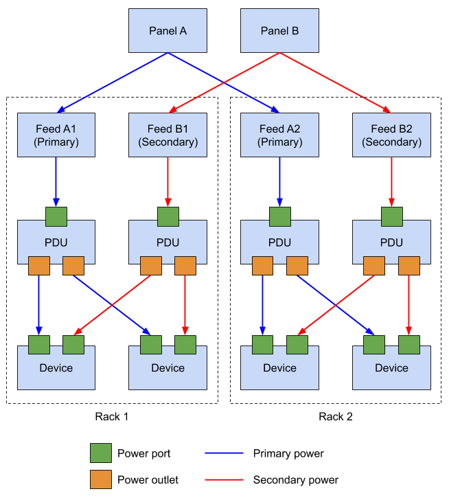

# Power Outlets

Power outlets represent the outlets on a power distribution unit (PDU) or other device that supply power to dependent devices. Each power port may be assigned a physical type, and may be associated with a specific feed leg (where three-phase power is used) and/or a specific upstream power port. This association can be used to model the distribution of power within a device.

For example, imagine a PDU with one power port which draws from a three-phase feed and 48 power outlets arranged into three banks of 16 outlets each. Outlets 1-16 would be associated with leg A on the port, and outlets 17-32 and 33-48 would be associated with legs B and C, respectively.

Cables can connect power outlets only to downstream power ports. (Pass-through ports cannot be used to model power distribution.)

+++ 1.4.5
    The fields `created` and `last_updated` were added to all device component models. If you upgraded from Nautobot 1.4.4 or earlier, the values for these fields will default to `None` (null).

## Example Power Topology

